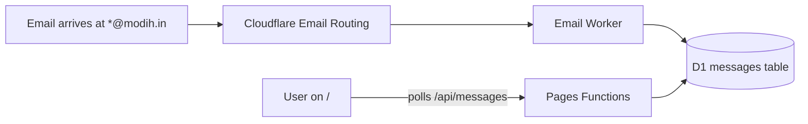

<!-- =====================================================================
     Modih Mail · modih.in
     Premium disposable email — cinematic, edge-native, API-driven.
     ===================================================================== -->

<div align="center">


# ✉️ Modih Mail &nbsp;·&nbsp; **Premium Disposable Email** `@modih.in`

### A cinematic, fully functional disposable email web app powered entirely by Cloudflare. Built for **speed**, **privacy**, and **aesthetics** — and now with a developer API for programmatic inboxes.

<a href="https://modih.in"></a>
<a href="https://modih.in/developer.html"></a>
<a href="https://modih.in/login.html"></a>
<a href="https://modih.in/billing.html"></a>

<br />

<a href="https://github.com/Abhinavv-007/modih-email/stargazers"></a>
<a href="https://github.com/Abhinavv-007/modih-email/commits/main"></a>


<br />

<sub><b>Cloudflare Pages · Functions · D1 · KV · Email Routing — zero servers, zero cold starts.</b></sub>

</div>

<br />

---

## ✦ The Pitch

> Disposable email shouldn't look like 2009. Modih Mail gives you a glassmorphic, cinematic inbox at `@modih.in` — pop a temporary address, watch messages drop in real-time, auto-destruct on demand, and (for builders) **drive the same flow through a clean REST API** with quota tracking, per-key analytics, and Bearer-token auth.

<table>
  <tr>
    <td width="50%" valign="top">
      <h3>📮 Premium temporary inbox</h3>
      <p>One click, one inbox. Receives in real time via Cloudflare Email Routing, persists in D1, and auto-destructs when you ask. No tracking. No retention beyond the inbox lifetime.</p>
    </td>
    <td width="50%" valign="top">
      <h3>🔐 Sign-in tier</h3>
      <p>Google sign-in for users who want a stable inbox alias and history across devices. Premium tier unlocks longer retention + custom usernames.</p>
    </td>
  </tr>
  <tr>
    <td width="50%" valign="top">
      <h3>🛠 Developer API</h3>
      <p>Full programmatic access — create inboxes, list messages, delete inboxes, all with API keys, quotas, per-key usage analytics, and a real-time dashboard.</p>
    </td>
    <td width="50%" valign="top">
      <h3>⚡ 100% Cloudflare</h3>
      <p>Pages + Functions + D1 + KV + Email Routing — globally distributed, zero cold starts, costs that round to zero at small scale.</p>
    </td>
  </tr>
  <tr>
    <td width="50%" valign="top">
      <h3>🎨 Cinematic UI</h3>
      <p>HTML / CSS / vanilla JS — but with motion, glass surfaces, intentional typography, and a phone-mail hero video that loops on the homepage.</p>
    </td>
    <td width="50%" valign="top">
      <h3>🛡 Privacy-respecting</h3>
      <p>No invasive tracking. Messages live in D1 only as long as the inbox does. Delete an inbox and its messages drop with it.</p>
    </td>
  </tr>
</table>

---

## ✦ Core Surfaces

| Page | Purpose |
| --- | --- |
| `/` (`index.html`) | Generate inbox, watch messages live, copy address, destroy on demand |
| `/login.html` | Google sign-in (Firebase Auth) |
| `/billing.html` | Free / Premium / Developer plan management |
| `/developer.html` | Developer dashboard — keys, quotas, usage chart, cURL/Node/Python examples |
| `/admin.html` | Admin tools (gated) |
| `/security.html` · `/privacy.html` · `/terms.html` · `/refund.html` · `/impressum.html` | Legal |

---

## ✦ Architecture

```mermaid
flowchart LR
    Visitor([Visitor]) --> Pages[modih.in<br/>Cloudflare Pages]
    Pages -->|/api/*| Functions[Cloudflare Functions]
    Functions -->|inbox + messages| D1[(D1 Database)]
    Functions -->|rate limits + counters| KV[(KV: RATE_LIMIT)]
    Functions -->|Firebase ID token| FB[Firebase Auth]
    EmailRouting[Cloudflare Email Routing] -->|*@modih.in| Functions
    Dev([Developer client]) -->|Authorization: Bearer modih_…| Functions
```

---

## ✦ Public REST API

> Stable. Production. CORS-ready (use the right header).

Base URL: **`https://modih.in`**

### Auth schemes

| Use case | Header |
| --- | --- |
| Public anonymous use | `X-Owner-Token: <token>` returned by `POST /api/inbox` |
| Developer plan | `Authorization: Bearer modih_xxx` |
| Signed-in user | `Authorization: Bearer <Firebase ID token>` |

### `POST /api/inbox` — create a fresh inbox

```bash
curl -X POST https://modih.in/api/inbox \
  -H "Content-Type: application/json"
```

Response:

```json
{
  "id": "abc1def2ghi3jkl4",
  "address": "abc1def2ghi3jkl4@modih.in",
  "owner_token": "ot_5fc1...",
  "expires_at": "2025-12-12T18:30:00Z"
}
```

> Save `owner_token`. Anonymous reads/deletes need it; signed-in / API-key flows do not.

### `GET /api/messages?inbox_id={id}` — fetch messages

```bash
curl "https://modih.in/api/messages?inbox_id=abc1def2ghi3jkl4" \
  -H "X-Owner-Token: ot_5fc1..."
```

```bash
# Or with a Developer API key
curl "https://modih.in/api/messages?inbox_id=abc1def2ghi3jkl4" \
  -H "Authorization: Bearer modih_live_xxx"
```

### `DELETE /api/inbox?id={id}` — destroy inbox + messages

```bash
curl -X DELETE "https://modih.in/api/inbox?id=abc1def2ghi3jkl4" \
  -H "X-Owner-Token: ot_5fc1..."
```

---

## ✦ Programmatic Snippets

### Node.js

```ts
const API = "https://modih.in";
const KEY = process.env.MODIH_API_KEY!;

// 1) Create inbox
const inbox = await fetch(`${API}/api/inbox`, {
  method: "POST",
  headers: { Authorization: `Bearer ${KEY}` },
}).then((r) => r.json());

console.log("inbox:", inbox.address);

// 2) Poll for messages
const messages = await fetch(
  `${API}/api/messages?inbox_id=${inbox.id}`,
  { headers: { Authorization: `Bearer ${KEY}` } },
).then((r) => r.json());

// 3) Burn it
await fetch(`${API}/api/inbox?id=${inbox.id}`, {
  method: "DELETE",
  headers: { Authorization: `Bearer ${KEY}` },
});
```

### Python

```python
import os, requests

API = "https://modih.in"
KEY = os.environ["MODIH_API_KEY"]
HEADERS = {"Authorization": f"Bearer {KEY}"}

inbox = requests.post(f"{API}/api/inbox", headers=HEADERS).json()
print("inbox:", inbox["address"])

messages = requests.get(
    f"{API}/api/messages",
    params={"inbox_id": inbox["id"]},
    headers=HEADERS,
).json()

requests.delete(
    f"{API}/api/inbox",
    params={"id": inbox["id"]},
    headers=HEADERS,
)
```

### Bash one-liner — disposable signup catcher

```bash
INBOX=$(curl -s -X POST -H "Authorization: Bearer $MODIH_API_KEY" https://modih.in/api/inbox)
ADDR=$(echo "$INBOX" | jq -r .address)
ID=$(echo "$INBOX" | jq -r .id)

echo "Use this in the signup form: $ADDR"
sleep 30
curl -s -H "Authorization: Bearer $MODIH_API_KEY" \
  "https://modih.in/api/messages?inbox_id=$ID" | jq
```

---

## ✦ Developer Plan Endpoints

The signed-in developer dashboard lives at `/developer.html`. Under the hood it talks to:

| Method | Endpoint | Purpose |
| --- | --- | --- |
| `GET` | `/api/auth/me` | Current user + plan |
| `GET` | `/api/developer/usage` | Rolling usage chart data |
| `GET` | `/api/developer/keys` | List your API keys |
| `POST` | `/api/developer/keys` | Create a new API key |
| `DELETE` | `/api/developer/keys?id=…` | Revoke a key |
| `POST` | `/api/developer/keys?id=…` | Rotate / update a key |

All Developer endpoints require a Firebase ID token:

```http
Authorization: Bearer <Firebase ID token>
```

> Free / Premium plans use the same `/api/inbox` and `/api/messages` endpoints; only the Developer plan can mint and use `Bearer modih_…` keys with quota tracking.

---

## ✦ Limits & Errors

| Error | Cause |
| --- | --- |
| `401 unauthorized` | Missing / invalid token |
| `403 forbidden` | Token does not own this inbox or plan does not allow this action |
| `404 not found` | Inbox already destroyed or never existed |
| `429 rate limited` | KV-backed rate limit hit (per-IP and per-key) |
| `5xx` | Functions or upstream issue — retry with jitter |

Rate limit headers (when present):

```http
X-RateLimit-Limit: 60
X-RateLimit-Remaining: 41
X-RateLimit-Reset: 1738271520
```

---

## ✦ Tech Stack

<p>
  
  
  
  
  
  <br/>
  
  
  
  
  
</p>

---

## ✦ Local Dev

```bash
git clone https://github.com/Abhinavv-007/modih-email.git
cd modih-email
npm install

# spin up Pages + Functions locally
npx wrangler pages dev public --d1=DB --kv=RATE_LIMIT
```

> The static site lives in `public/`. The serverless API lives in `functions/api/*`. They both deploy together as one Cloudflare Pages project.

Postal flow:



---

## ✦ Project Layout

```text
modih-email/
├── public/
│   ├── index.html          # Inbox UI
│   ├── login.html          # Google sign-in
│   ├── developer.html      # Developer dashboard
│   ├── billing.html        # Plan management
│   ├── admin.html          # Admin tools
│   ├── styles.css, *.js
│   ├── phone-mail-bg.png   # Hero
│   └── (legal pages)
├── functions/
│   ├── _middleware.js      # CORS, JSON, error envelope
│   ├── _auth-helper.js     # Firebase ID token verification
│   ├── _api-helpers.js     # Common helpers
│   └── api/
│       ├── inbox.js        # POST + DELETE /api/inbox
│       ├── messages.js     # GET /api/messages
│       ├── contact.js      # Support form
│       ├── auth/me.js
│       ├── developer/      # /api/developer/{keys,usage}
│       └── admin/          # gated admin routes
├── wrangler.toml           # D1 + KV + Pages config
├── package.json            # name: modih-email
├── DESIGN.md, ROADMAP.md, ARCHITECTURE.md
├── DEPLOYMENT_CHECKLIST.md
└── CONTRIBUTING.md, SECURITY.md, CODE_OF_CONDUCT.md, LICENSE
```

---

## ✦ Roadmap (highlights)

- [x] One-click temporary inboxes
- [x] Real-time message arrival
- [x] Premium plan with custom usernames
- [x] Developer plan with API keys + quotas
- [x] Per-key analytics + revoke / rotate
- [ ] Webhooks for incoming messages
- [ ] Per-team developer organisations
- [ ] More aggressive zero-retention modes

---

## ✦ Star History

<a href="https://star-history.com/#Abhinavv-007/modih-email&Date">
  
</a>

---

<div align="center">
  <sub>✉️ Built by <a href="https://abhnv.in"><b>Abhinav Raj</b></a> · powered end-to-end by Cloudflare.</sub>
  <br/>
  <a href="https://abhnv.in">Portfolio</a> · <a href="https://www.linkedin.com/in/abhnv8/">LinkedIn</a> · <a href="https://x.com/Abhnv8">X</a> · <a href="https://www.instagram.com/abhnv08/">Instagram</a>
</div>
