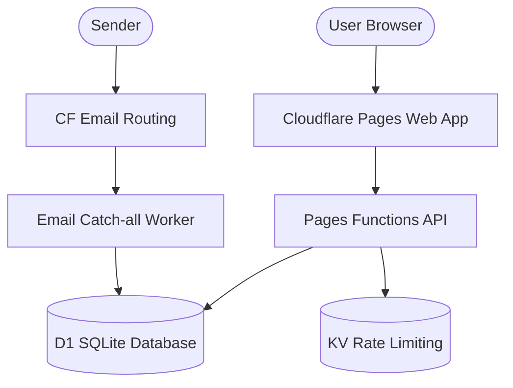

<div align="center">
  

  # ✉️ Modih Mail
  **Premium Disposable Email @modih.in**
  
  <p align="center">
    A cinematic, fully functional disposable email web app powered entirely by Cloudflare infrastructure. Built for speed, privacy, and aesthetics.
  </p>

  <div>
    
    
    
    
    
  </div>

  <br />
  <a href="https://modih.in"><strong>View Live Demo »</strong></a>
</div>

<br />

---

## ✨ Cinematic Aesthetics
Modih Mail isn't just another utility; it's designed to be an experience.
* **Glassmorphism UI:** Translucent frosted-glass panels over vivid, high-quality looping video backgrounds.
* **Micro-interactions:** Smooth transitions, hover states, typewriter text effects, and popping count-down timers.
* **Responsive Design:** Completely adaptive layout mapping a cinematic desktop experience down to a streamlined mobile app feel.

---

## 🚀 Core Features

<table>
  <tr>
    <td width="50%">
      <h3>📬 Instant Disposable Email</h3>
      <p>Generate secure, random <b>@modih.in</b> addresses instantly. Upgrade to Pro to reserve your own custom prefixes.</p>
    </td>
    <td width="50%">
      <h3>⏳ Auto-Destructing</h3>
      <p>Privacy first: Free inboxes and all their contents self-destruct entirely after <b>3 hours</b> (Up to 7 days for Pro).</p>
    </td>
  </tr>
  <tr>
    <td width="50%">
      <h3>🔑 Smart OTP Detection</h3>
      <p>Automatically scans incoming emails and extracts <b>verification codes</b>, highlighting them for 1-click copying.</p>
    </td>
    <td width="50%">
      <h3>🛡️ Safe Rendering Engine</h3>
      <p>Incoming HTML emails are scrubbed server-side. Scripts, iframes, and remote tracking pixels are aggressively stripped.</p>
    </td>
  </tr>
  <tr>
    <td width="50%">
      <h3>🔒 Enterprise-Grade Abuse Prevention</h3>
      <p>Rate limits via <b>Cloudflare KV</b>, device fingerprint clustering via <b>D1</b>, and invisible CAPTCHA via <b>Turnstile</b>.</p>
    </td>
    <td width="50%">
      <h3>⚡ 100% Edge Hosted</h3>
      <p>No central servers. Hosted entirely on <b>Cloudflare Pages, Workers, KV, and D1</b> for 0ms cold starts worldwide.</p>
    </td>
  </tr>
</table>

---

## 🏗️ Architecture Stack

The entire stack lives on the Edge, utilizing Cloudflare's ecosystem to provide a database-backed, real-time application without a traditional backend server.



* **Frontend:** Vanilla JS + CSS (Zero frameworks for maximum speed).
* **Backend API:** Cloudflare Pages Functions (`/api/inbox`, `/api/messages`, `/api/contact`).
* **Database:** Cloudflare D1 (Serverless SQLite) storing active inboxes and encrypted messages.
* **Mail Ingestion:** Cloudflare Email Routing → Email Worker (`postal-mime` parser).
* **Security:** Cloudflare Turnstile & KV Rate Limiting.
* **Support Contact Form:** Integrated with Resend API.

---

## 💻 Local Development

1. **Clone the repository:**
   ```bash
   git clone https://github.com/Abhinavv-007/modih-email.git
   cd modih-email
   ```

2. **Install dependencies:**
   ```bash
   npm install
   ```

3. **Start the local Cloudflare dev server:**
   ```bash
   npm run dev
   ```
   *The app will be available at `http://localhost:8788`. Note: Email receiving requires the production Cloudflare Email Routing setup to function.*

---

## 🚀 Deployment Guide

### 1. Database & KV Setup
```bash
# Create the D1 Database
wrangler d1 create modih-mail-db

# Initialize the schema
wrangler d1 execute modih-mail-db --file=final-desptop-tab.sql

# Create the Rate Limit KV
wrangler kv namespace create RATE_LIMIT
```
*(Remember to map the resulting IDs into your `wrangler.toml` file.)*

### 2. Environment Secrets
Run the following commands to securely add your API keys to the Pages project:
```bash
wrangler pages secret put TURNSTILE_SITE_KEY
wrangler pages secret put TURNSTILE_SECRET
wrangler pages secret put RESEND_API_KEY
```

### 3. Deploy Frontend & API
```bash
wrangler pages deploy public --project-name=modih-email
```

### 4. Deploy Email Ingestion Worker
```bash
cd email-worker
npm install
wrangler deploy
```
*After deploying the worker, ensure you configure Cloudflare Email Routing to Catch-All and forward to the newly deployed `modih-mail-email-worker`.*

---

<div align="center">
  <p>Built with ❤️ by Abhinav.</p>
  <p>
    <a href="https://abhnv.in">Portfolio</a> •
    <a href="https://linkedin.com/in/abhnv07">LinkedIn</a> •
    <a href="https://lnch.in">Launch</a>
  </p>
</div>
